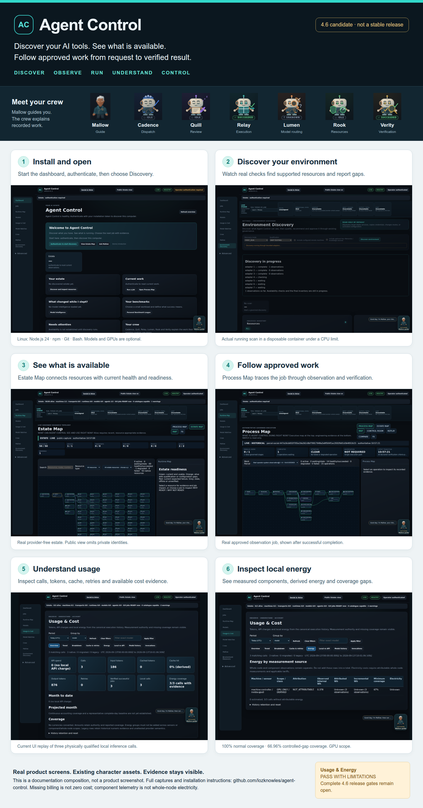
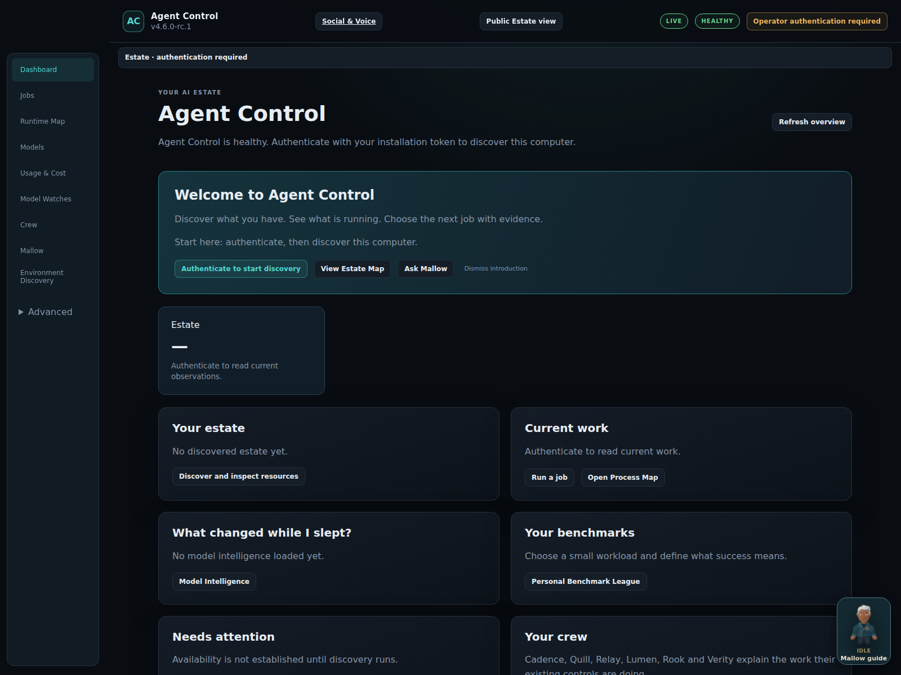
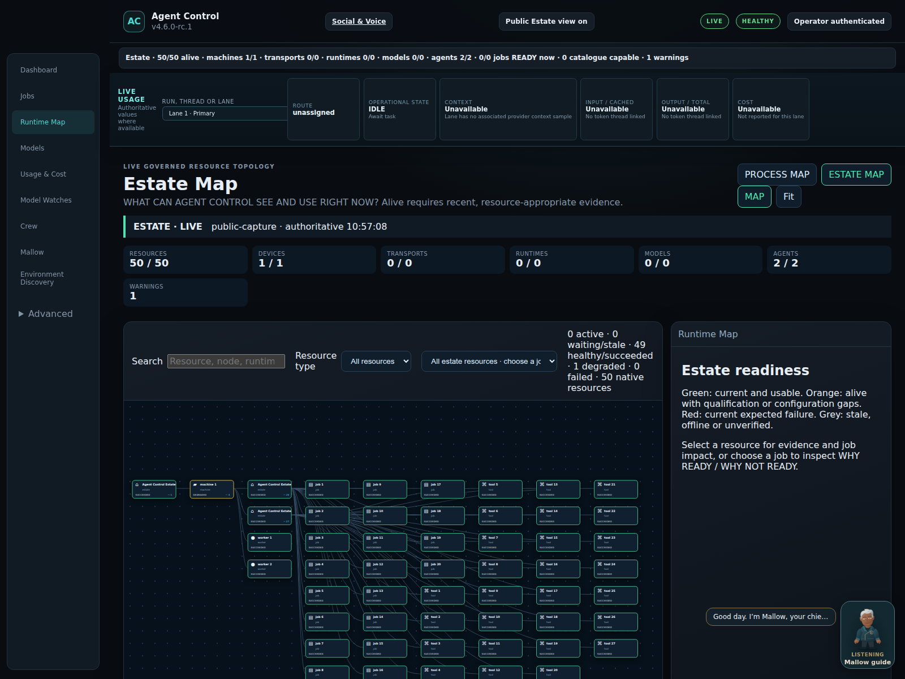
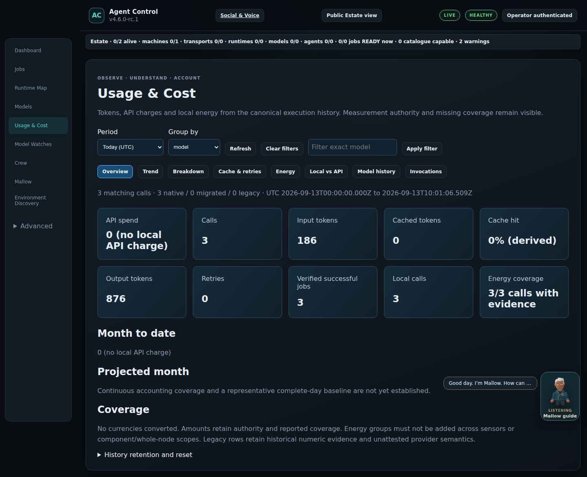

# Agent Control

Discover your AI tools, see what is available, and follow approved work from request to verified result.

**Current stable release: [4.5.1](https://github.com/lozknowles/agent-control/releases/tag/v4.5.1).** This branch is **4.6.0-rc.1**, an unreleased candidate. It is **not ready for the complete 4.6 release**; see the [release assessment](docs/public-release-readiness-4.6.md).

[Install Agent Control](docs/installation-first-run.md) · [Documentation](docs/index.md) · [Upgrade](docs/upgrade-4.6.md) · [Release notes](docs/release-notes-4.6.0-rc.1.md)

[](docs/public-installation-journey.md)

## Discover → Observe → Run → Understand → Control

- **Discover** supported machines, agents, runtimes, models and integrations already in your environment.
- **Observe** what is alive and available in the graphical Estate Map.
- **Run** authorised jobs and follow their steps and evidence in Process Map.
- **Understand** calls, tokens, retries, cache, cost availability and local component energy.
- **Control** work through permissions, policies, readiness checks and explicit approvals.

Mallow is your floating guide. The established crew helps explain dispatch, review, tools, model routing, resources and verification. [Meet the crew](docs/crew-guide.md).

<a id="install"></a>

## Try the candidate

For the stable version, use the [4.5.1 installation documentation](https://github.com/lozknowles/agent-control/blob/v4.5.1/docs/DEPLOYMENT.md). To review this candidate on Linux with Node.js 24, npm, Git and Bash:

```bash
git clone --branch feature/4.6-model-intelligence-showcase https://github.com/lozknowles/agent-control.git
cd agent-control
git rev-parse HEAD
./scripts/bootstrap-agent-control.sh --check --target "$PWD"
./scripts/bootstrap-agent-control.sh --install --role control --target "$PWD"
read -rsp "Agent Control operator token: " AGENT_CONTROL_WEB_OPERATOR_TOKEN
printf '\n'
export AGENT_CONTROL_WEB_OPERATOR_TOKEN
npm run web
```

Choose a private operator token of at least 32 characters and keep it in your password manager. Open **http://127.0.0.1:4310**, select **Authenticate to start discovery**, and enter that token. Then select **Discover my environment**. Follow the [illustrated installation guide](docs/installation-first-run.md) through Discovery and the first governed job.

A GPU, model server, paid API, Codex, VPN and Home Assistant are optional capabilities, not dashboard prerequisites.



## See what is available; follow what is happening

**Estate Map** shows known resources, relationships and current health. Discovered does not mean alive, authenticated or qualified. Select a resource to inspect its evidence and gaps.

**Process Map** shows an actual job's execution and result. Job and worker links connect work back to its Estate resources.

The [real installation journey](docs/public-installation-journey.md) shows the first screen, discovery progress, results, Estate, Process and Mallow. Screenshots are captured from the running product, not generated UI.

[](docs/public-installation-journey.md#e--estate-and-inspector)

## Understand usage and local energy



Usage records distinguish model/provider, local/API execution, tokens, cache evidence, retries and billing availability. **Missing billing evidence is not zero cost.** Subscription-included Codex is non-metered for monetary billing qualification.

**Usage & Energy: PASS WITH LIMITATIONS.** Local token accounting, inference semantics and component interval energy have physical evidence. Normal runs had 100% measurement coverage; a controlled sampling gap had 66.96% coverage, with missing intervals excluded.

Metered API billing, positive physical cache billing, attributable job/baseline energy, physical tariff qualification and whole-node electricity remain **BLOCKED_EXTERNAL**. Component measurements do not establish whole-node or cloud energy. [Physical evidence and limitations](docs/usage-energy-physical-closure-4.6.md).

## Start with a small job

The [public Job Library](https://github.com/lozknowles/agent-control-jobs) contains simple objectives such as reviewing a change or diagnosing a service. Estate-based readiness identifies required configuration, connectors, credentials and approval. Contributions should remain understandable without learning Agent Control internals.

Model Intelligence and personal benchmark views are candidate features. Target-model qualification and overnight showcase evidence remain open; they are not implied by a working dashboard.

## Learn more

- [Android / fresh Termux prerequisites](android/README.md#fresh-termux-prerequisites) (separate platform guide)
- [Installation and troubleshooting](docs/installation-first-run.md#troubleshooting)
- [Safe existing-install upgrade](docs/upgrade-4.6.md)
- [Architecture](docs/architecture-v2-agnostic.md)
- [Security](SECURITY.md) and [contributing](CONTRIBUTING.md)
- [Candidate release notes](docs/release-notes-4.6.0-rc.1.md)
- [Complete release readiness and evidence](docs/public-release-readiness-4.6.md)

Historical versioned reports remain available under `docs/`; use the installation guide above for this candidate.
