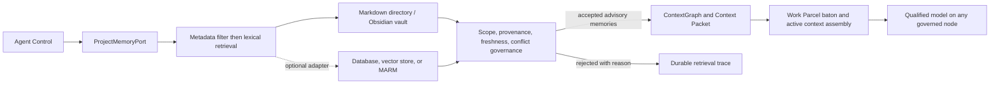

# Agent Control 4.5 project-memory portability experiment

Status: experimental. Normal user-facing UX calls this capability **Your Memories**. `ProjectMemoryPort` and backend names are technical terms used only in architecture, diagnostics, and evidence.

Agent Control treats durable memory as advisory context. A memory cannot alter a Work Parcel, approve work, grant authority, replace a baton, or satisfy verification. Current repository and physical evidence outrank remembered claims. Assistant memory is an untrusted source and follows the same checks.



The first backend stores a JSON metadata envelope in a human-readable Markdown note. Obsidian can display the directory, but core uses no Obsidian API. Every record binds project and optional repository/session scope, originating node and route, source, confidence, verification timestamps, expiry/revalidation, provenance IDs and hashes, supersession links, and a content hash.

Retrieval filters scope, rejects invalid/unverified/expired/superseded records, detects contradictory current records sharing a fact key, then ranks lexically under item and byte limits. Conflicting values are all rejected; rank never decides factual authority. Semantic retrieval remains an optional future adapter.

## Cross-node storage rule

Each node writes to a node-local staging namespace using an exclusive writer lock, owner-only temporary file, and atomic rename. Cross-node synchronization must copy immutable content-addressed notes and record source/destination hashes before promotion. Nodes must not concurrently edit one canonical note. A name collision with unequal content is a conflict, never last-writer-wins.

The discovered vaults are independent:

- hpubuntu: `/home/loz/knowledge-vault` (small local Git repository, no remote);
- MSI experiment vault: `D:\obsidian\knowledge_vault` (local vault, no Git repository at discovery time);
- MSI's separate OneDrive-backed vault is out of scope and remains untouched.

The isolated namespace is `Agent Control/4.5-memory-portability`. No existing notes are overwritten.

## Promotion lifecycle

```text
working context -> baton/session summary -> candidate memory
  -> provenance and independent validation -> durable verified memory
  -> bounded retrieval -> revalidation, supersession, invalidation, or forget
```

Model output may propose a candidate. Agent Control binds evidence and controls promotion. Routine observations and transient conversation remain ephemeral.

## Qualification boundary

Deterministic tests prove atomic writes, integrity checks, bounded retrieval, scope isolation, expiry rejection, candidate rejection, contradiction detection, and explicit supersession. Physical writer/reader cells are reported only when the exact provider, model, endpoint/version, and node execute through a real governed route. An unavailable route remains `NOT EXERCISED`; no substitute model is implied.
