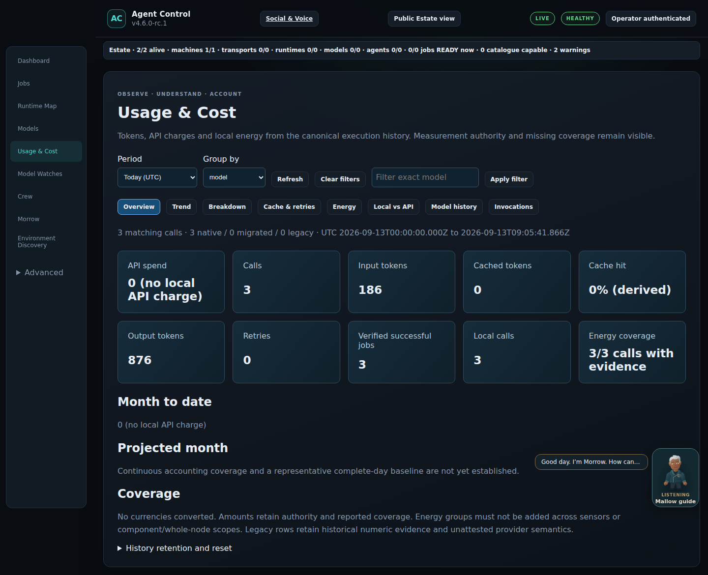
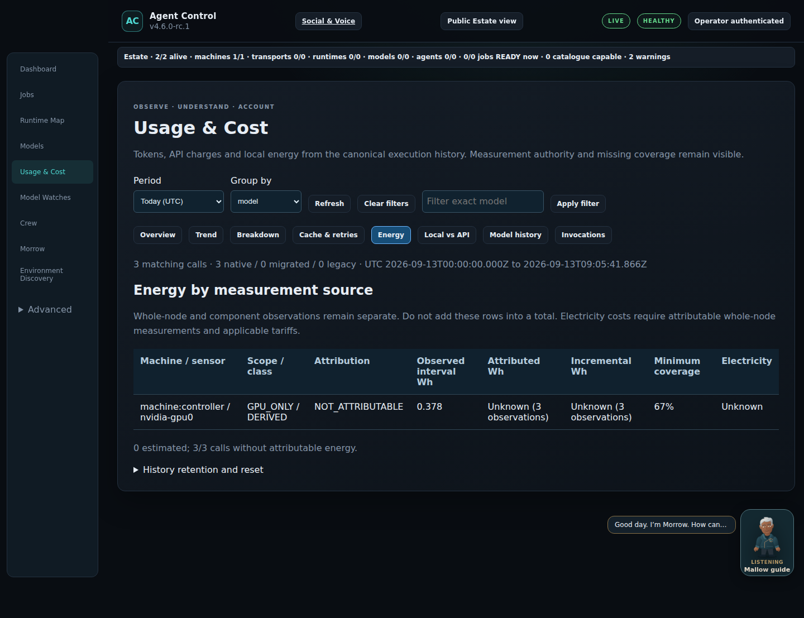

# Real Agent Control installation journey

[Installation guide](installation-first-run.md) · [Release assessment](public-release-readiness-4.6.md)

New first-run captures are being qualified from the public candidate in a disposable Linux installation. This development checkpoint does not yet claim those pending captures or installation checks passed. Historical real Usage and Energy images below retain their original physical provenance.

## A — First dashboard

Capture pending current public-install qualification.

## B — Setup and discovery

Setup, actual running progress and completed results will be recorded separately.

## E — Estate and inspector

Current public-install capture pending.

## G — Process Map

Current governed observation-job capture pending.

## H — Usage and Cost

## I — Energy

These two existing screenshots come from the [sealed physical closure](usage-energy-physical-closure-4.6.md). They are not seeded first-run examples. Component measurements are not whole-node or attributable job energy.

## J — Mallow and the crew

Current public-label capture pending.
