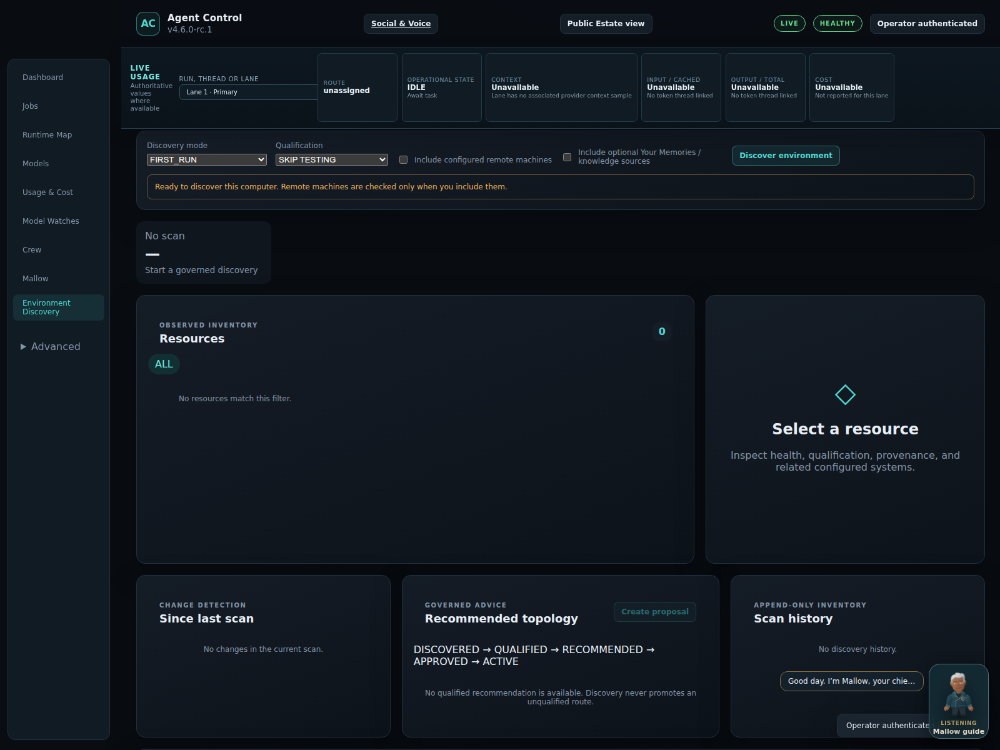
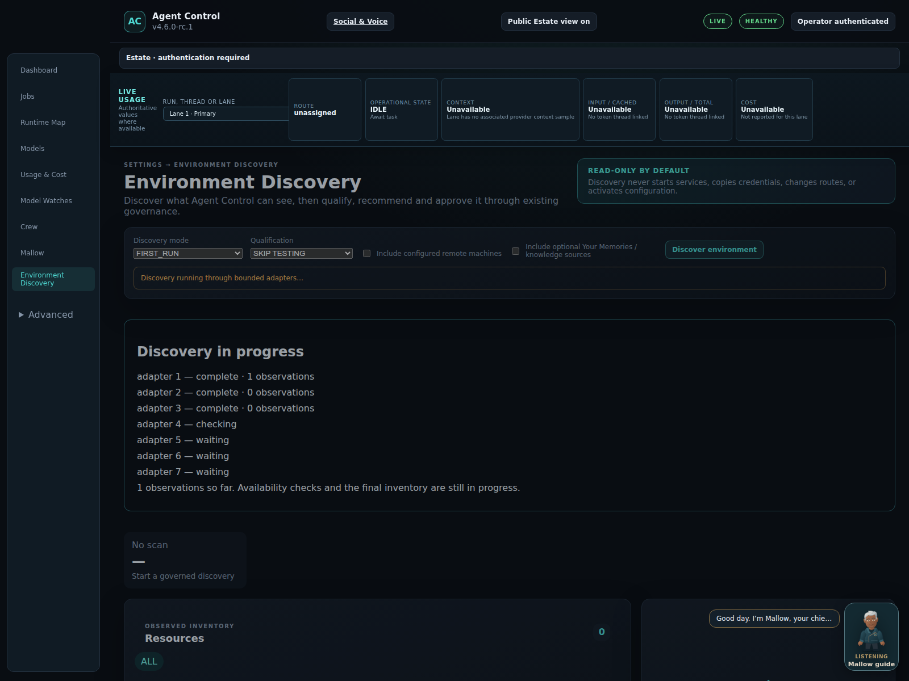
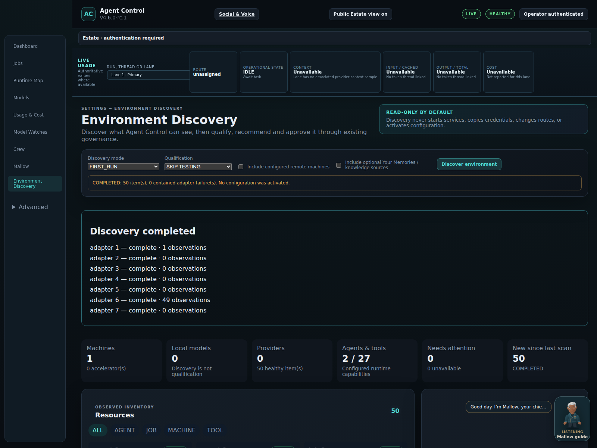
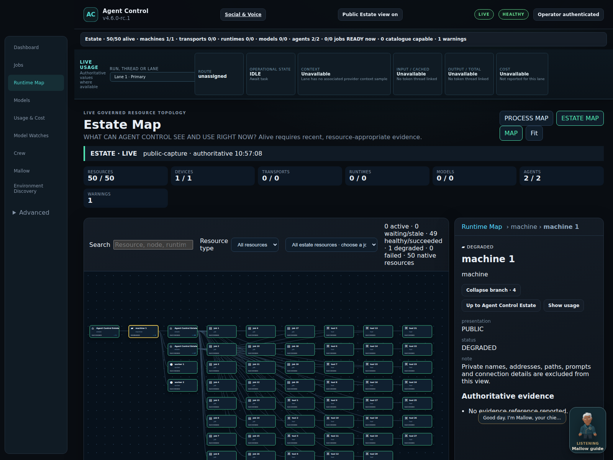
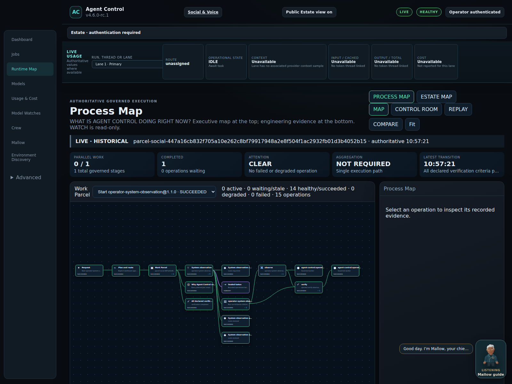
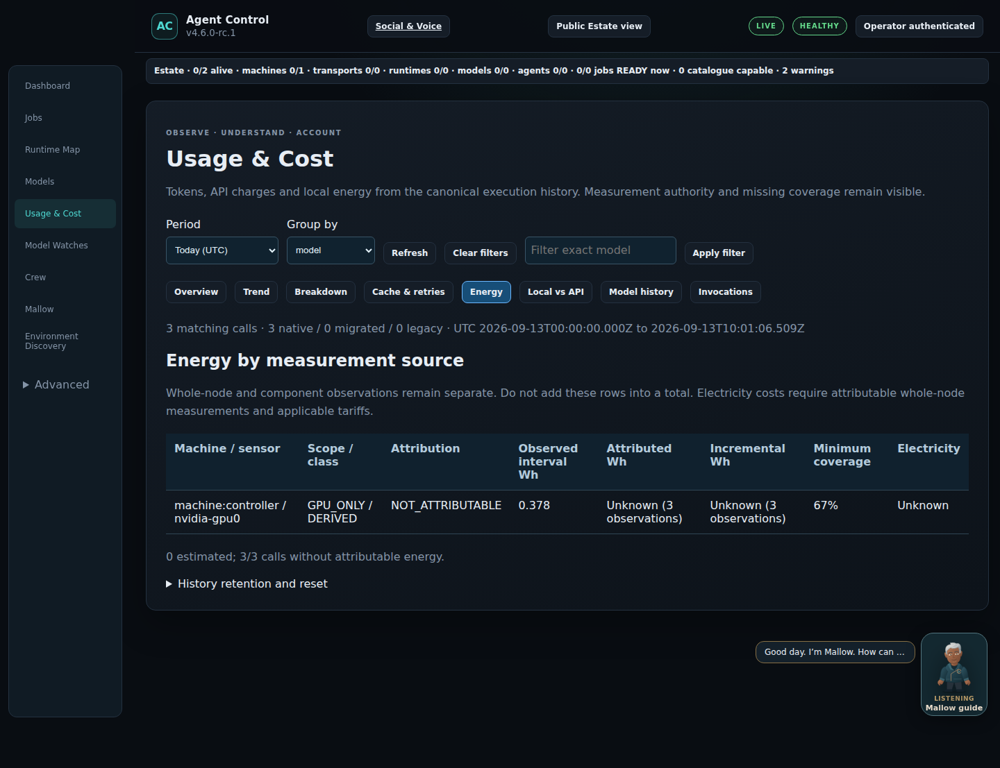
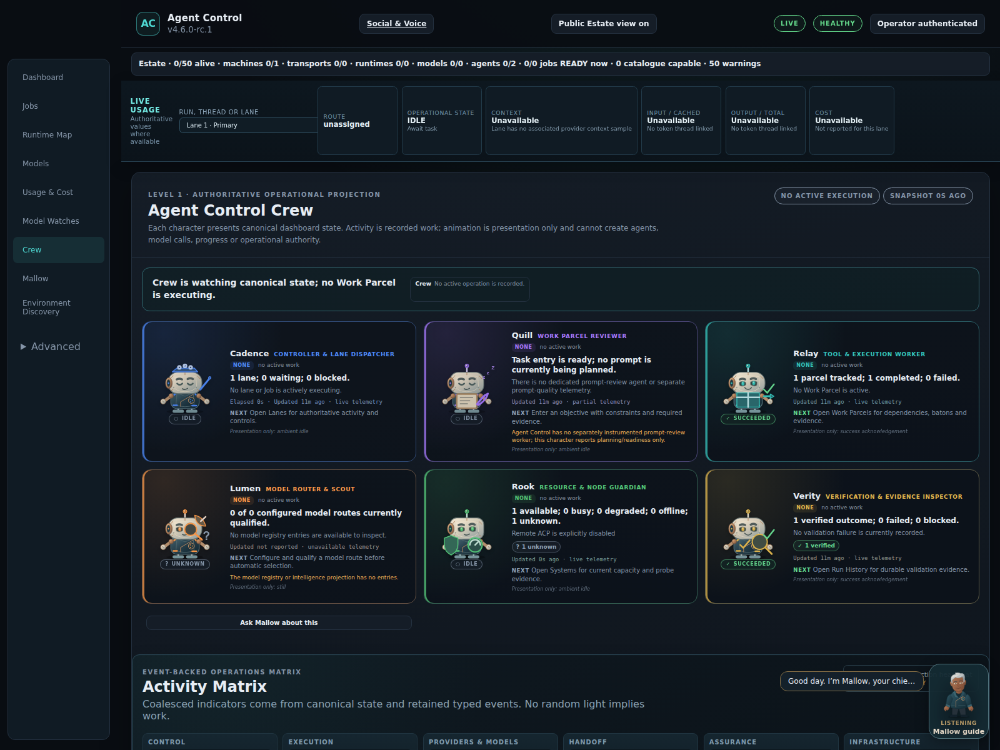
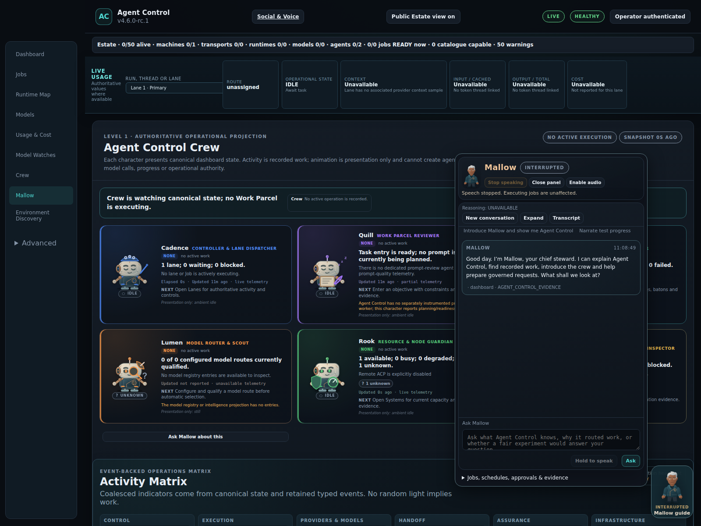
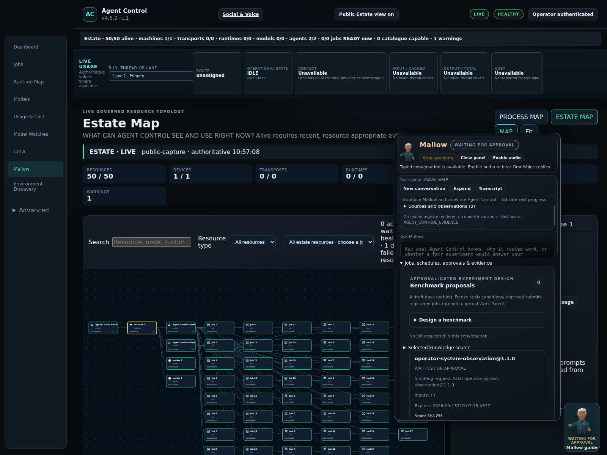
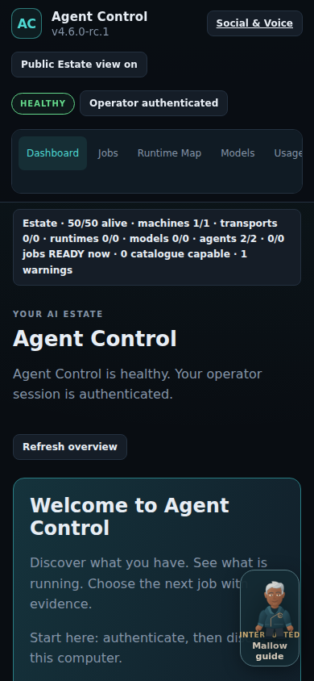

# Real Agent Control installation journey

[Install Agent Control](installation-first-run.md) · [Release assessment](public-release-readiness-4.6.md) · [One-page overview](media/4.6/public/overview.png) · [High resolution](media/4.6/public/overview-2x.jpg)

These **13 real product screenshots** cover the new-user journey. They are not generated UI. The [capture manifest](../examples/showcase-4.6/public-preparation/screenshots.json) records exact source commits and checksums.

The first-run journey uses a disposable Linux container cloned from public GitHub, without models, GPUs or paid-provider credentials. Discovery and Estate screenshots use the product's public presentation mode, which omits private identities and inspector details. Full original captures are shown below; the separate overview is a documentation composition.

## A — First dashboard

Agent Control is healthy; authenticate to start discovery. Mallow remains available as the floating guide. Empty history is expected.

## B — Setup and discovery

Local discovery is selected and remote probing is off. Optional models and integrations are not prerequisites.

### C — Discovery running

The normal scan was too quick for a useful progress frame. This actual scan ran with a 0.05 CPU quota on the disposable container, removed afterwards. No artificial adapter results or simulated progress were inserted.

### D — Discovery results

This instance found one machine and its registered capabilities, with no GPU, local model or configured provider. Finding a resource does not qualify it for every job.

## E — Estate and inspector

The fresh estate contains built-in jobs, tools and workers. Availability and job readiness are separate. The machine's qualification gap remains visible.

### F — Resource inspector

This is the real inspector with private details intentionally excluded by the product. An authenticated private view contains the underlying identity and evidence.

## G — Process Map

The documented observation job was explicitly approved and completed **SUCCEEDED**. This capture shows its completed history, including observe, verify and the final verification result; it is not an active-work demonstration.

## H — Usage and Cost

Three physically qualified native calls: **186 input + 876 output = 1,062 tokens**. This is a current-UI replay of a copy of the sealed [physical closure](usage-energy-physical-closure-4.6.md), not seeded first-run activity or a new inference run. Missing monetary evidence is not zero cost.

## I — Energy

The same physical history shows GPU component scope, derived interval energy and **NOT_ATTRIBUTABLE** status. Normal runs had 100% coverage; the controlled gap had 66.96% coverage, rounded to 67% in the aggregate UI. Unmeasured intervals are excluded. The older discovery evidence is correctly stale during replay.

Whole-node electricity, tariffs and job attribution remain unqualified.

## J — Mallow and the crew

[Established crew roles](crew-guide.md). Artwork and characters come directly from the product. Their animation does not constitute execution evidence.

### Review an approval

Expand the disclosure and scroll its panel to review the full proposal and approval control. A proposal alone does not start work.

### Mobile layout

The browser check found no document-width overflow at 390 × 844 with reduced motion. This is viewport qualification, not a physical phone test.
