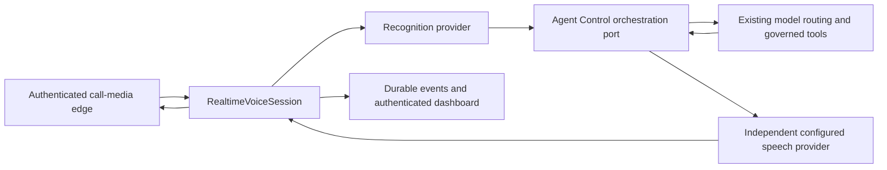

# Realtime conversational voice — EXPERIMENTAL / PARTIAL

WhatsApp realtime calling: **BLOCKED**. Asynchronous WhatsApp text and voice notes: existing private-pilot behaviour preserved. These are separate modes; installing the session code does not enable calling.

## Interfaces and lifecycle

RealtimeVoiceTransport owns authenticated incoming signaling, observed caller identity, accept/reject, decoded input delivery, paced audio egress, output suppression and hangup. It must assert duplex, interrupt and isolated-caller-audio capability; the coordinator rejects otherwise. RTP/WebRTC jitter, clock conversion, echo cancellation and queued playout suppression belong to the media edge. No WhatsApp media adapter is enabled in this candidate.

RealtimeVoiceSession receives ordered 16kHz mono PCM16 frames of 20ms. A bounded experimental energy VAD detects voice and ends an utterance after 500ms silence. A gap discards the partial utterance; duplicates and malformed frames are rejected. Utterances are capped at 30 seconds, calls at 10 minutes, conversational history at 100 messages, TTS output at 60 seconds and tool calls at four per turn. These are resource/heuristic settings, not acoustically qualified PASS thresholds.

Ingress continues while output is being sent. Detection aborts the active STT/model/TTS turn, increments an output generation fence and calls transport suppression. The next turn waits for suppression acknowledgement. Every awaited result is fenced against interruption, revocation and session termination. A provider ignoring AbortSignal cannot inject a late reply into the next turn. Adapter operations have deadlines. Transport cleanup failures are recorded as unconfirmed, not success. Reconnect is not implemented: process recovery ends uncertain media sessions and preserves history rather than replaying them.

## Speech modes

bufferedRecognition adapts the existing SpeechRecognitionProvider using bounded PCM WAV input. This is utterance-buffered STT; partial transcripts and understanding during an unfinished utterance are unavailable. PrivatePcmSpeech uses the existing authenticated worker's explicit WAV response and frames/resamples its complete output to 16kHz PCM. It is **buffered-then-framed**, not native streaming OmniVoice. The voice-note worker's Ogg/Opus mode and 0.9 playback speed remain unchanged. PCM framing currently uses the worker's raw-WAV mode; its pacing/voice quality needs separate call qualification.

A future native streaming speech provider implements IncrementalVoiceSpeech without changing reasoning-model routing. Streaming recognition requires a further adapter contract before partial STT may be advertised. The experimental energy VAD has no acoustic echo cancellation and must not receive mixed speaker/microphone audio.

## Intelligence and governance

VoiceOrchestration is an injected boundary for existing Agent Control routing and governed tool execution; no direct model endpoint or arbitrary shell is added. Model results carry final answer text, route reason and optional usage, never private chain-of-thought. The same session transcript and configured voice are passed across a model change. Model-change events are not proof of a governed escalation; a production adapter must supply router/handoff evidence from the existing execution contracts. No realtime orchestration adapter or naturally justified live escalation is qualified here.

boundVoiceAuthority requires an explicit exact observed-call-identity to enrolled-messaging-identity binding and checks enrolment again on each action. Display names and phone-number resemblance cannot create bindings. Ambiguous bindings fail closed. Initial tool grants allow only status/models/nodes/health; consequential actions remain in the established text-confirmation workflow. Tool execution receives session/actor/idempotency correlation and cancellation. Do not attach an ungoverned function to this trusted orchestration port.

## Persistence and dashboard

The private SQLite store uses WAL/FULL durability and contains approved display identity, a caller hash, stable session identity and chronological events. Raw call-media/session secrets are not stored. One controller owns a store; it must not be opened by a second active media owner. Conversation history is preserved as events; restart does not automatically resume calls.

The authenticated `/voice-sessions.html` view and `/api/voice-sessions` endpoint show the transport blocker, session states, model/voice/providers, turn/tool/interruption counts, usage/cost fields and measured latency where available. Unknown values remain unavailable. Enable only history storage with `AGENT_CONTROL_REALTIME_VOICE_HISTORY=true`; this does not enable call acceptance. Transcript downloads are operator-authenticated. No public media-ingress endpoint exists.

Transcripts contain CALL CONNECTED, USER SPEECH, STT, MODEL, TOOL REQUEST/RESULT, MODEL HANDOFF, TTS FIRST AUDIO, INTERRUPTION and CALL ENDED events plus a session summary. p50/p95 are withheld below 20 observations, which is a display policy rather than a release threshold. Transport acknowledgement time must not be described as measured handset acoustics. Raw model/tool output must already satisfy the existing redaction rules before it enters the orchestration port.

## Failure and fallback

STT/TTS/model failures abort the turn and record a text/voice-note fallback recommendation; no guessed transcription is executed. The session layer does not stop or mutate the asynchronous messaging services. It does not automatically send a fallback WhatsApp message because no qualified call identity mapping/transport has been installed. Caller disconnect, cancellation and transport loss should invoke session.end with the actual reason. Duplicate calls remain durable duplicates after termination.

## Qualification required before enabling calls

Provision/verify a Calling API media edge or separately qualify an explicitly selected experimental sidecar. Verify caller binding, frame ordering, echo isolation, egress pacing and generation fencing; then perform the real five-minute handset conversation with two interruptions, context retention, governed read-only tool, natural escalation, unchanged voice and clean hangup. Measure speech detection to acoustic output suppression and end-of-utterance to audible response before agreeing acceptance thresholds. No substitute fixture or assembled voice-note video satisfies these gates.
